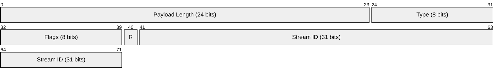
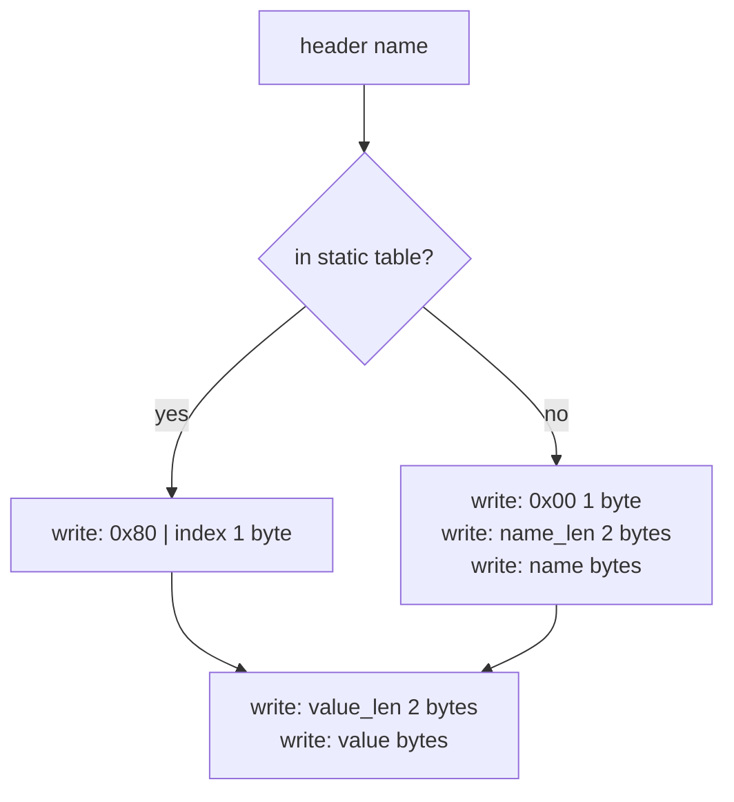
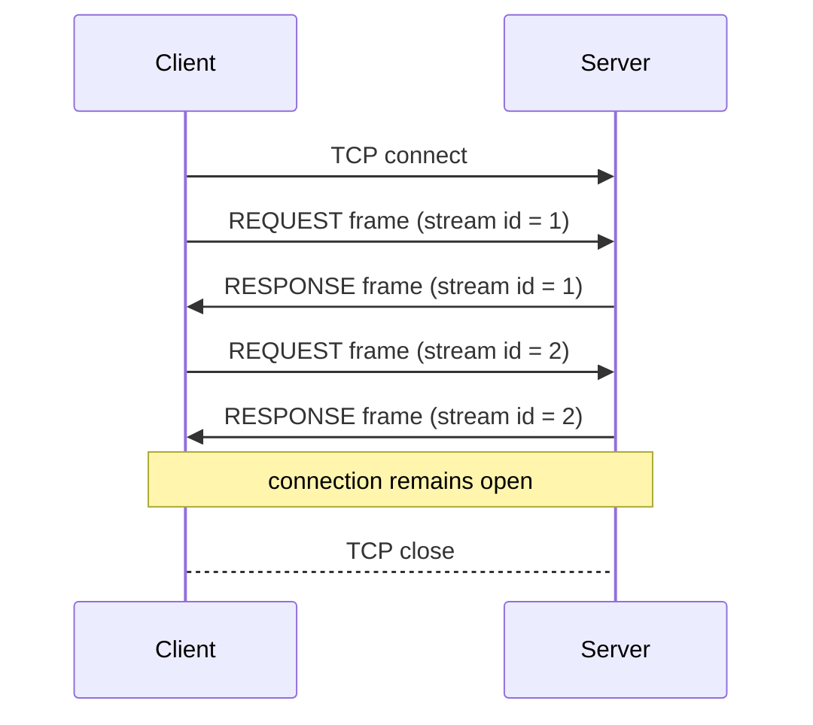

# BHTTP/1.0 — Binary HTTP Protocol Specification

**Version:** 1.0  
**Date:** October 2026

---

## 1. Overview

BHTTP/1.0 is a minimal request-response protocol that runs directly over a persistent TCP connection. It replaces the text-based HTTP/1.1 framing with a compact binary frame format. A client sends one REQUEST frame per resource it wants; the server replies with one RESPONSE frame and keeps the connection open for the next request.

The design intentionally mirrors HTTP/2's frame header so that the same defence of bit-width choices applies, and so that a future BHTTP/2 implementation can reuse all tooling that understands the 9-byte header prefix.

---

## 2. Frame Header

Every message begins with exactly **9 bytes** in the following layout (all integers are big-endian):



| Field | Bytes | Description |
|---|---|---|
| **Length** | 3 | Size of the payload that follows, in bytes. Maximum 16,777,215 bytes per frame. |
| **Type** | 1 | Identifies the frame type (see §3). |
| **Flags** | 1 | Type-specific modifier bits (see §3). |
| **Stream ID** | 4 | Bit 31 (the MSB) is reserved and must be sent as 0; a receiver must ignore it. Bits 30-0 are the stream identifier. |

**Defence of bit widths.**
HTTP/2 settled on this exact layout for good reasons. Twenty-four bits for the length lets a single frame carry up to 16 MB without fragmentation — enough for any reasonable static-file response. Eight bits for the type gives 256 possible frame types; v1.0 uses four of them, leaving ample room for future versions. Thirty-one bits for the stream ID avoids the signed/unsigned ambiguity that arises on some 32-bit runtimes when the high bit is set, while still allowing over two billion concurrent logical streams.

---

## 3. Frame Types

| Type | Value | Used in v1.0 |
|---|---|---|
| REQUEST | `0x00` | client to server |
| RESPONSE | `0x01` | server to client |
| DATA | `0x02` | reserved for v2 |
| GOAWAY | `0x03` | reserved for v2 |

A receiver that encounters a frame type it does not recognise **MUST** read the full payload (using the Length field to determine how many bytes to consume) and discard it, then continue reading the next frame. This is the single rule that guarantees forward compatibility with future versions.

### Flags

Two flags are defined for both REQUEST and RESPONSE frames:

| Flag | Bit value | Meaning |
|---|---|---|
| END_STREAM | `0x01` | This is the last frame in the stream. |
| END_HEADERS | `0x04` | All headers for this message are included in this frame. |

v1.0 always sets both flags, since each message fits in one frame.

---

## 4. REQUEST Frame Payload (`0x00`)

Sent by the client. The payload is laid out as follows:

```
+----------+------------------+
| ML  (1)  | Method  (ML)     |   Method: length-prefixed, 1-byte prefix
+----------+------------------+
| PL  (2)  | Path    (PL)     |   Path: length-prefixed, 2-byte prefix
+----------+------------------+
| HC  (2)  | Headers ...      |   Header block (see section 5)
+----------+------------------+
| Body (remaining bytes)      |   Zero or more bytes
+-----------------------------+
```

- **ML** — 1 byte: length of the method string in bytes.
- **Method** — ML bytes: ASCII method name, e.g. `GET`.
- **PL** — 2 bytes big-endian: length of the path string in bytes.
- **Path** — PL bytes: absolute URL path including the leading `/`.
- **HC** — 2 bytes big-endian: number of header entries that follow.
- **Headers** — HC encoded header entries (see section 5).
- **Body** — all remaining bytes in the payload. Empty for GET requests.

---

## 5. RESPONSE Frame Payload (`0x01`)

Sent by the server. The payload is laid out as follows:

```
+----------+------------------+
| SC  (2)  | Status Code      |   2-byte big-endian HTTP status code
+----------+------------------+
| HC  (2)  | Headers ...      |   Header block (see section 5)
+----------+------------------+
| Body (remaining bytes)      |   File content or error message
+-----------------------------+
```

- **SC** — 2 bytes big-endian: HTTP status code (`200`, `400`, `404`, ...).
- **HC** — 2 bytes big-endian: number of header entries.
- **Headers** — encoded per section 5.
- **Body** — all remaining bytes. Empty body is valid.

---

## 6. Header Encoding

Header encoding uses HPACK's first two mechanisms: a static index table for common names, and length-prefixed literal strings for everything else.

### 6.1 Static Table

The ten most common header names are assigned a fixed integer index:

| Index | Name |
|---|---|
| 1 | `host` |
| 2 | `content-type` |
| 3 | `content-length` |
| 4 | `user-agent` |
| 5 | `accept` |
| 6 | `accept-encoding` |
| 7 | `connection` |
| 8 | `server` |
| 9 | `date` |
| 10 | `last-modified` |

Header names are always lowercased before encoding and after decoding.

### 6.2 Wire Format Per Header



**Indexed name** (name is in the static table):
```
[ 0x80 | idx (1 byte) ]  [ value_len (2 bytes) ]  [ value bytes ]
```

**Literal name** (name is not in the static table):
```
[ 0x00 (1 byte) ]  [ name_len (2 bytes) ]  [ name bytes ]  [ value_len (2 bytes) ]  [ value bytes ]
```

The high bit of the first byte distinguishes the two cases: `1` means indexed, `0` means literal. All length prefixes are 2-byte big-endian unsigned integers. All strings are UTF-8.

---

## 7. Connection Model



- The server MUST keep the TCP connection open after every response.
- A client MUST use the same TCP connection for all requests in a session and MUST NOT open a second connection.
- Stream IDs start at 1 and increment by 1 for each new request on the same connection.
- The server matches the stream ID from the request in its response.

---

## 8. Error Handling

| Status | Condition |
|---|---|
| `200` | File found and delivered. |
| `400` | REQUEST payload could not be parsed, or the requested path contains a traversal component (`..`). |
| `404` | The requested path does not map to an existing file under the server root. |

After sending a `400` or `404` response the server leaves the connection open and awaits the next REQUEST frame.
